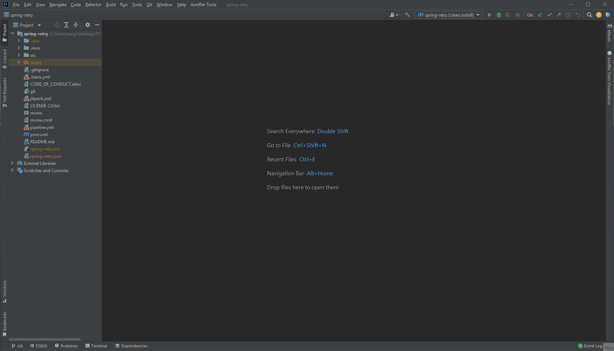

# Asniffer Tools

This plugin is going to integrate the [Asniffer](https://github.com/metaisbeta/asniffer) and [Avisualizer](https://github.com/metaisbeta/avisualizer) capabilities into your IDE, JetBrains InteliJ.

**How to use:**
* Install this plugin. You can find it at [InteliJ Marketplace](https://plugins.jetbrains.com/plugin/18237-asniffer-visualizer)
* Open your java project in your InteliJ IDE
* Open the visualization in the side bar.
* Click the "Avisualizer Tools -> Run Asniffer" button in the menu bar.

**Plugin Description:**
<!-- Plugin description -->
**Asniffer Tools** is a plugin for **Java** projects that provides a deep annotation analysis and a visualization for your project. 
We will provide an integrated annotation visualization in a Web Browser (based on GIdea Browser).

The main goal of this project is make it easier to integrate the Asniffer Ecosystem into your favorite IDE. Please check your [project](https://github.com/metaisbeta/intelliJ-avisualizer-plugin) for more information.

This plugin supports every Java version above 5.0.
<!-- Plugin description end -->

