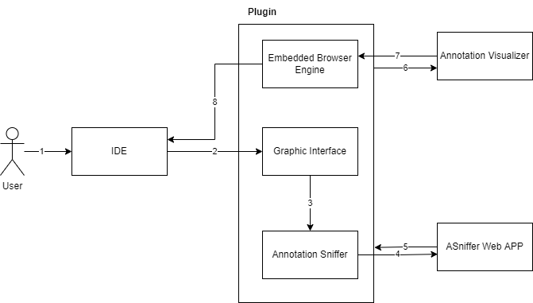
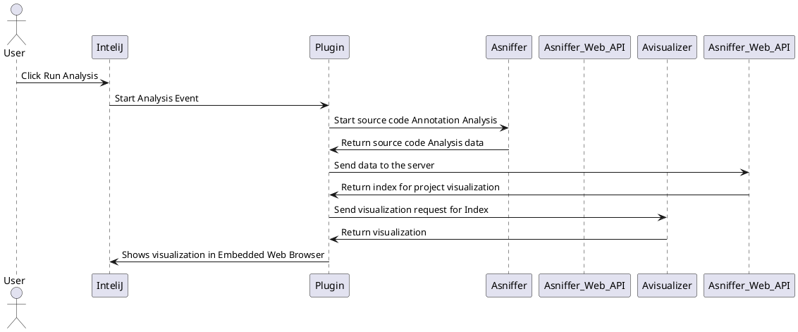

---

title: 'Annotation Visualizer Plugin: A tool to Visualize an Extract Code Annotations Metrics' tags:

- Java
- metadata
- annotations
- software-engineering
- source-code-analysis
- visualization
- plugin
- product integration authors:
- name: Sérgio Pires orcid: 0000-0000-0000-0000 affiliation: "1" #
- name: Phyllipe Lima orcid: 0000-0002-8358-4405 affiliation: "1" #
- name: Eduardo Guerra orcid: 0000-0001-5555-3487 affiliation: "1" #
- name: Paulo Meirelles orcid: 0000-0002-8923-2814 affiliation: "1" #
- name: Everaldo Gomes orcid: 0000-0002-8923-2814 affiliation: "1" # affiliations:
- name: UFABC, Universidade Federal do ABC, Brazil index: 1 date: 12 March 2022 bibliography: paper.bib

---

# Summary

Code annotations is a very common attribute in popular languages like Java and C#. Annotation Sniffer is a tool to 
analyse notation usages in Java, it runs an analysis and return a series os results in a JSON document. Annotation 
Visualizer is another tool developed by *** that could enable a visualization for the code generated by Annotation 
Sniffer. This document is about a plugin developed to IDEA IntelliJ IDE that encapsulates the visualization and the 
analysis in one project. It can read the users current repository and generate a visualization in the embedded broswer
conteined in the plugin. It also generates a shareable link with can be shared with others.

Code annotations were introduced in version 5 of the programming language Java. Its main function is to add customizable
metadata to programmatic elements variables, such as methods and classes. This metadata can be consumed by tools and
frameworks to collect additional information about the software, allowing you to customize finalization and execution in
different ways (LIMA; GUERRA; MEIRELLES, 2020a). To analyze its effectiveness, studies on software metrics help us to
understand better how these notations are used in a technical way. Among the research that were developed in this field,
Annotation Sniffer (ASniffer) and Annotation Visualizer (AVisualizer) (LIMA; GUERRA; MEIRELLES, 2020a), are two tools
which, together, manage to give us an analysis and visualization of the use of notations within of a project. The
objective of this work is, in a collaborative way, to apply the concepts of software engineering and agile methods to
develop free software that is capable to integrate Annotation Sniffer and Annotation Visualizer. This software will be a
plugin for the IntelliJ development platform, which will analyze the projects opened by the Annotation Sniffer and will
show the result visually, using the AVisualizer viewer.

The use of notations in code is now used extensively in many projects Java, such as Spring Boot, EJB, JPA and JUnit.
Looking at the top 30 Java projects ranked on the GitHub platform, they have, on average, 76% of classes with at least a
notation. Some of these projects have more than 90% of these annotated classes. (LIME; WAR; MEIRELLES, 2020a) One of the
tools that does notation analysis is the Annotation Sniffer. That tool uses the Java Development Tools (JDT) API to
build the Abstract Syntax Tree (AST) of the text files contained in the source code. ASniffer scans entire VST visiting
all nodes collecting information from code elements. After processing it, generates a report in JSON or XML. This report
contains several metrics, described in the publication A Metrics Suite for code annotation assessment
(LIMA et al., 2018) on notations, their uses and relationships. The metric notation research ecosystem has expanded with
the development from ASniffer, and based on the work Towards Visualizing Code Annotations Distribution
(LIMA; GUERRA; MEIRELLES, 2020b) a viewer was developed for the reports 2 Chapter 1. Introduction generated by ASniffer,
which is Avisualizer. Currently, this project is developed via free software1 and is available in a web version2. Being
able to view the use of annotations can identify possible bad practices or identify possible opportunities for use in
developing Java code. The use of these tools can empower the developer to take actions that make their code cleaner and
more performant. However, currently, for the developer to use these tools, he will need to have the AVisualizer and
ASniffer sources locally in your machine, run three analyzes through ASniffer and plug the files into the code count the
AVisualizer to be able to visualize. Given this problem, the opportunity arose to automate data visualization for the
developer in an integrated way with their development environment. How The IntelliJ IDE is the top-rated JVM development
platform for developers. developers, according to Stack Overflow's 2019 annual assessment (STACKOVERFLOW, 2019), we
chose to develop free software in plugin format for the platform, that does the analysis and gives us a viewer in an
integrated way.

# Statement of need


# Metadata and Code Annotations

A variety of contexts in the computer science field uses the term "metadata". In all of them, it means data referring to
the data itself. In databases, the data are the ones persisted, and the metadata is their description, i.e., the
structure of the table. In the object-oriented context, the data are the instances, and the metadata is their
description, i.e., information that describes the class. As such, fields, methods, super-classes, and interfaces are all
metadata of a class instance. A class field, in turn, has its type, access modifiers, and name as its
metadata [@guerra2014].

Some programming languages provide features that allow custom metadata to be defined and included directly on
programming elements. This feature is supported in languages such as Java, through the use of annotations and in C#, by
attributes. A benefit is that the metadata definition is closer to the programming element, and its definition is less
verbose than external approaches. Annotations are a feature of the Java language, which became official on version 1.5.
The code on Listing 1 presents a simple ```Player``` class using code annotation to perform the object-relational
mapping.

```java

@Entity
@Table(name = "Players")
public class Player {

    @Id
    @GeneratedValue(strategy = GenerationType.IDENTITY)
    private int id;
    @Column(name = "health")
    private float health;

    @Column(name = "name")
    private String name;

    //getters and setters omitted
}
```

Listing 1: Example of code annotations

To map this `Player` class to a table in a database, to store the player's information, we need to pass in
some `extra information` about these code elements. In other words, we need to define an object-relational mapping, and
we need to configure which elements should be mapped to a column, table, and among others. Using code annotations
provided by the JPA API, this mapping is easily achieved. When this code gets executed, the framework consuming the
annotations knows how to perform the expected behavior.

# Annotation Metrics

Our work in [@LIMA2018] proposed a novel suite of software metrics dedicated to code annotations. In this section, we
briefly describe them and demonstrate how they are calculated. We have three categories of metrics:

- Class Metric: Outputs one value per class.
- Code Element Metric: Outputs one value per code element (fields, methods, among others).
- Annotation Metric: Outputs one value per code annotation.

- Annotations in Class (AC): It counts the number of annotations declared on all code elements in a class, including
  nested annotations. In our example code, the value of AC is equal to 10. It is a ```Class Metric```.

- Unique Annotations in Class (UAC): While AC counts all annotations, even repeated ones, UAC counts only distinct
  annotations. Two annotations are equal if they have the same name, and all arguments match. For instance, both
  annotations \texttt{@AssociationOverride} are different, for they have a nested annotation \texttt{@JoinColumn} that
  have different arguments. The first is \texttt{EX\_ID} while the latter is \texttt{O\_ID}. Hence they are distinct
  annotations and will be computed separately. The UAC value for the example class is nine. Note that the annotation
  \texttt{@TransactionAttribute()} is counted only once. It is a ```Class Metric```.

- Annotations Schemas in Class (ASC): An annotation schema represents a set of related annotations provided by a
  framework or tool. This measures how coupled a class is to a framework. This value is obtained by tracking the imports
  used for the annotations. On the example code, the ASC value is two. The import \texttt{javax.persistence} is a schema
  provided by the JPA, and the import \texttt{javax.ejb} is provided by EJB. It is a ```Class Metric```.

- Arguments in Annotations (AA): Annotations may contain arguments. They can be a string, integer, or even another
  annotation. The AA metric counts the number of arguments contained in the annotation. For each annotation in the
  class, an AA value will be generated. For example, the \texttt{@AssociationOverrides} has only one argument named
  \texttt{value}, so the AA value is equal one. But \texttt{@AssociationOverride}, contains two arguments, \texttt{name}
  and \texttt{joinColumns}, so the AA value is two. It is an ```Annotation Metric```.

- Annotations in Element Declaration (AED): The AED metric counts how many annotations are declared in each code
  element, including nested annotations. In the example code, the method \texttt{exampleMethodA} has an AED value of
  two, it has the \texttt{@TransactionAttribute} and \texttt{@DiscriminatorColumn}. It is a ```Code Element Metric```.

- Annotation Nesting Level (ANL): Annotations can have other annotations as arguments, which translates into nested
  annotations. ANL measures how deep an annotation is nested. The root level is considered value zero. The annotations
  \texttt{@Stateless} has ANL value of zero, while \texttt{@JoinColumn} has ANL equals two. This data is because it has
  \texttt{@AssociationOverride} as a first level, and then the \texttt{@AssociationOverrides} adds another nesting
  level, hence the value ANL is two. It is an ```Annotation Metric```.

- LOC in Annotation Declaration (LOCAD): LOC (Line of Code), is a well-known metric that counts the number of code
  lines. We proposed LOCAD as a variant of LOC that counts the number of lines used in an annotation declaration.
  \texttt{@AssociationOverrides} has a LOCAD value of five, while \texttt{@NamedQuery} has LOCAD equals four. It is
  an ```Annotation Metric```.

# Annotation Sniffer

The ASniffer tool uses the JDT[^1](Java Development Tools) API to build the Abstract Syntax Tree (AST) from a text file
containing the source code. The ASniffer traverses this AST, visiting the nodes and gathering information about the code
elements. After the processing is done, it generates an XML as output.

[^1]: \url{https://www.eclipse.org/jdt/}

To create the AST (Abstract Syntax Tree), we use the method \texttt{ASTParser.createASTs}. This method is exposed by the
JDT and receives an array of strings containing the file path of each source code that we wish to analyze. Another
parameter for the method is a class that will handle the compilation units. Our class is the \texttt{MetricsExecutor}
and this class must extend the \texttt{FileASTRequestor}. From inside \texttt{MetricsExecutor} we call every metric
class and pass in the compilation unit (generated by the \texttt{ASTParser}).

To understand the extraction process, we will use a snippet from the code that collects the `Annotations in Class`
metric, presented in Listing 3. Since this is a ```Class Metric```, i.e., outputs one value per class, it must extend
the \texttt{ASTVisitor} class and implement our custom interface ```IClassMetricCollector```. The superclass provides
methods that are used to visit the nodes from the Compilation Unit. For instance, for the AC metric, we visit every
annotation encountered, and increment the value for ```annotations```. Our custom interface provides two methods, the
first one, (\texttt{execute()}), initializes the extraction process, while the second one, (\texttt{setResult()}), is
where the result is stored.

```java

@ClassMetric
public class AC extends ASTVisitor implements IClassMetricCollector {
    //We also visist MarkerAnnotation and SingleMemberAnnotation
    private int annotations = 0;

    @Override
    public boolean visit(NormalAnnotation node) {
        annotations++;
        return super.visit(node);
    }

    @Override
    public void execute(CompilationUnit cu, MetricResult result,
                        AMReport report) {
        cu.accept(this);
    }

    @Override
    public void setResult(MetricResult result) {
        result.addClassMetric("AC", annotations);
    }
}
```

Listing 3: Snippet from the code that implements the Annotations in Class metric

# Annotation Visualizer

The Annotation Visualizer is also a predecessor to the \emph{plugin} proposed in this work. It is responsible for
receiving the parameters of the project and rendering, in an HTML page, its view. To achieve our goal, we added the
possibility to recognize a query parameter in the project URL. The query parameter of this project must be the same UUID
generated by the Asniffer API, from this information, we consult the Annotation Sniffer API and render the project on
the screen according to its search index, so we can have a dynamic and integrated view with our ecosystem. During the
execution of this project, all its technology was changed from Angular to React, so we had to modify our project to meet
this new technology.

# Annotation Sniffer Web API

In software development, it is very common for the team to share tool views with the team, such as monitoring logs and
dashboards. During the development of our solution, we came across a need to have projects saved in a cloud environment.
Our solution for this problem were develop a cloud application that could enable our analysis sharing.

Its function is to be able to save, update and consult projects generated by a user. Each project has its own ID that
identifies it. From this ID, it is possible to load the information generated by ASniffer by a REST request. The API was
implemented in Java, using MongoDB as a database. API is currently hosted on the Heroku cloud service and the database
is hosted on MongoDB Atlas.

The decision to use a non-relational database comes from the need to store the documents that are generated by ASniffer.
The generated documents are in JSON archetype. For a comparison, we made an implementation with a PostgreSQL relational
database, but the performance was much lower than that of MongoDB.

# Annotation Visualizer Plugin

The plugin will be the user interface with the ASniffer ecosystem. It is a plugin for the InteliJ IDE, which is
developed and maintained by JetBrains. This plugin is responsible for showing a browser web to the user with a custom
view of Avisualizer. There are two ways to interact with the plugin, the first is a button that will be on the toolbar,
which will be responsible for starting the analysis of the user's current project. The second is a modified browser
integrated with the plugin. It will be responsible for showing the service preview of AVisualizer.

The \emph{browser} integrated in this plugin is an adaptation of the GIdea Browser, which is a free
(open source) implementation for InteliJ. The browser engine used by this project is the Java Chromium Embedded
Framework (JCEF), which is a free implementation of Chromium in the Java language, in which it has the APIs in which we
interact with the browser. Thus, plugin will be able to load custom URLs} via code, in this way we will show the user
your project, as exemplified in Figure

# System Architecture



To understand our system solution, we will use the figure as a basis. In step 1, the user interacts with the plugin
button and requests the analysis of the project. In step 2 the Annotation Sniffer is activated and analyzes the project
locally. Step 3 consists of sending the files generated by the analysis to the Annotation Sniffer API. Step 4 is to
receive the project ID within the Annotation Sniffer API. Step 5 consists of modifying the browser's URL so that it
receives the ID collected by the previous step as a parameter. Step 6 symbolizes the project Annotation Visualier
sending the page HTML to be displayed by the browser. Step 7 is the page being displayed by the docked browser, closing
our software loop.


To use the plugin, the user must install it in his version of InteliJ IDE. When enabled, the Asniffer option will be
shown in the navigation bar, as shown in Figure 1. By clicking on this button, the current project within the user's
development area will be scanned by the plugin, which is the use of the Asniffer tool within that project. At the end of
the metrics collection and processing, we will save the generated JSON files inside the IntelliJ configuration folder
and we will also send this file to the ASniffer API. APTI receives a REST request with this data, saves it in a database
MongoDB, generates a lookup index for the data, and returns it to the REST request. Having this ID in our application,
we will show in the browser attached to the plugin a URL of the AVisualizer containing this unique ID. With this ID as a
parameter, Avisualizer makes a request to the Asniffer API and renders the data according to what the application
responds to. A sequence diagram of this flow is shown in Figure.

# Related Work

We developed the ASniffer tool to support the research published on [@LIMA2018], i.e., collect the novel suite of
annotation metrics. Given that these were unpublished metrics, there are no available tools for comparison. However,
other tools perform static code analysis and collect metrics, such as the CK Tool [@aniche2015]. This open-source tool
collects the well-known CK (Chidamber-Kemerer) Metrics Suite [@ck91] as well as other object-oriented metrics for Java
projects. The CK Tool was also developed using the JDT API to build the Abstract Syntax Tree, which served as a
reference for the development of the ASniffer.

# License

<p>Annotation Sniffer is licensed under the GNU Lesser General Public License v3.0</p>
<p>Annotation Visualizer is licensed under the GNU Lesser General Public License v3.0</p>
<p>Annotation Sniffer Web API is licensed under the GNU Lesser General Public License v3.0</p>
<p>Annotation Visualizer Plugin is licensed under the GNU Lesser General Public License v3.0</p>

# Acknowledgements

This work is supported by FAPESP (Fundação de Amparo à Pesquisa do Estado de São Paulo), grant 2014/16236-6 and CAPES
(Coordenação de Aperfeiçoamento de Pessoal de Nível Superior)

# References